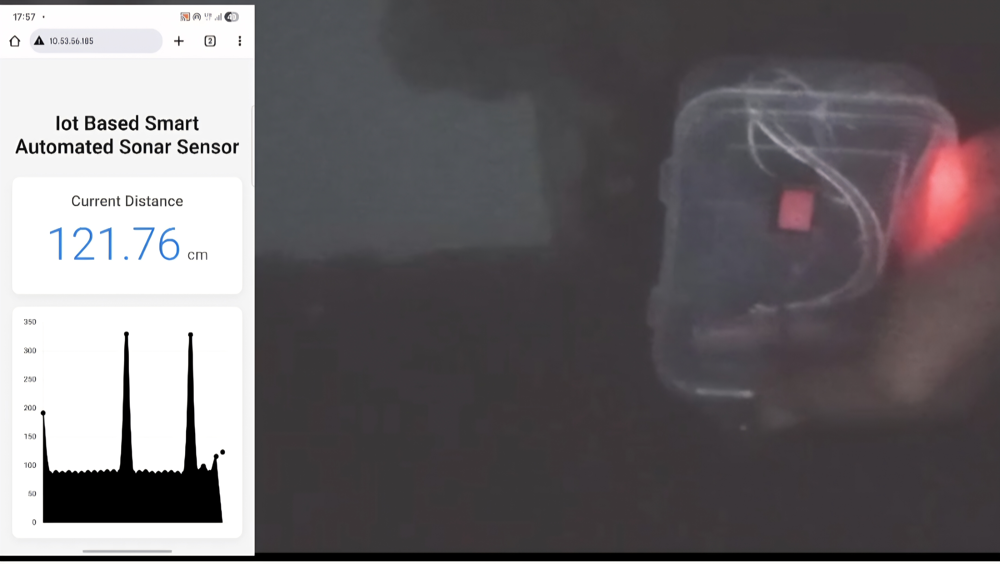
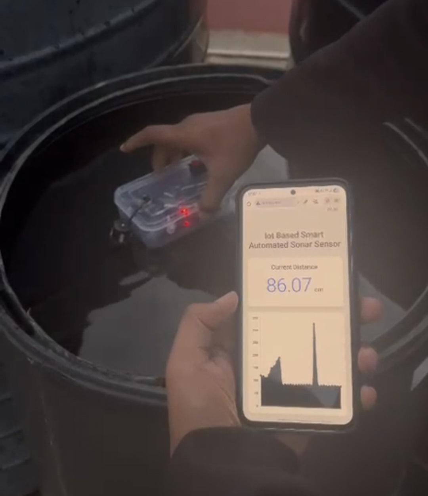

# IoT-Based Smart Automated Sonar System

## 📖 Overview
The IoT Based Smart Automated SONAR System is designed to provide continuous, non-contact distance monitoring and transmit real-time data wirelessly. Built to overcome the limitations of fragile wired sensors, this system executes automated, event-triggered alerts upon the breach of a predefined safety threshold .By integrating a rugged, waterproof ultrasonic sensor with a Wi-Fi-enabled microcontroller, the system offers a scalable solution for remote fluid level sensing and security perimeter detection .

## 🛑 The Problem It Solves
This project was engineered to address critical flaws in current distance monitoring methodologies :
* **Fragility of Entry-Level Systems**: Basic wired systems use cheap sensors (like the HC-SR04) that easily fail when exposed to moisture, humidity, or temperature variations. They also rely on a constant physical USB connection, restricting them to immobile indoor environments .
* **Cost and Complexity of Industrial Setups**: High-end industrial systems utilizing Programmable Logic Controllers (PLCs) are prohibitively expensive, require specialized training, and often lack native integration with modern, user-friendly IoT cloud platforms .
* **Inefficiency of Camera-Only Surveillance**: Visual monitoring fails in low-light, fog, or when obscured by debris. Furthermore, extracting distance data from video streams requires power-hungry computer vision algorithms that drain batteries and network bandwidth.

## 👥 The Team
Developed by 5th-semester Electronics and Communication Engineering students at Don Bosco Institute of Technology:
* **Jeevan R**
* **Kushal C** 
* **Kushal NS**
* **Pavan K**

## 🛠️ Hardware Architecture

The physical build prioritizes durability and autonomy for off-grid deployment:

* **Microcontroller**: The ESP32 DevKit acts as the central processor and manages the Wi-Fi connection . It calculates the distance from the Time-of-Flight (ToF) data and executes the automation logic for threshold checking. 
* **Ultrasonic Sensor**: The JSN-SR04T is a ruggedized sensor featuring an integrated sealed cable probe, making it ideal for outdoor and wet conditions. It operates using a 40 kHz ultrasonic pulse. 
* **Voltage Divider Circuit**: Crucial for hardware safety, this circuit uses a 1 kΩ resistor and a 2 kΩ resistor to step down the sensor's 5V ECHO output signal to a safe 3.3V level for the ESP32 input pins.
* **Power Management**: A 3.7V Li-ion battery, paired with a 5V Step-up (Boost) Converter, provides true autonomy and extended operational capability for off-grid deployment.
  

## 💻 Software & Dashboard
The system is programmed using the Arduino IDE . It hosts a custom embedded website for real-time data visualization:
* **Web Server**: Utilizes the `ESPAsyncWebServer` and `AsyncTCP` libraries to serve an HTML/CSS/JavaScript dashboard directly from the microcontroller .
* **Live Analytics**: Integrates Chart.js to plot distance measurements dynamically over a WebSocket connection.
* **IoT Cloud Link**: Capable of transmitting live distance values to cloud platforms via MQTT or HTTP for remote monitoring and event-triggered alerts.

## 🌍 Real-World Applications
* **Marine Navigation**: Assists autonomous underwater vehicles (AUVs) with collision avoidance and operates effectively in low-visibility murky waters.
* **Environmental Monitoring**: Continuously tracks reservoir water levels for flood prediction and management .
* **Industrial Automation**: Monitors liquid levels in manufacturing tanks and inspects oil/gas pipelines for leaks.
* **Defense & Security**: Used for border surveillance and intrusion detection by monitoring underwater or terrestrial environments .

## 🚀 Key Advantages

* **Cost-Effective**: The total Bill of Materials (BOM) is under ₹2500, making it 5-10 times cheaper than commercial sonar modules while matching performance for civilian applications .
* **High Efficiency**: Employs duty-cycled scanning at 500ms intervals; when combined with a Li-ion battery, it can achieve over 72 hours of autonomy .
* **Rapid Response**: Automated SMS/Telegram alerts via cloud dashboards reduce incident response times from minutes to mere seconds .

## ⚠️ Challenges & Limitations
* **Environmental Limitations**: Sonar accuracy and performance can be affected by water salinity, turbidity, or ambient noise interference .

* **Dependencies**: The system requires a stable power supply and reliable internet connectivity to ensure continuous remote monitoring .
* **Cybersecurity**: As with all IoT devices, the system is vulnerable to cyberattacks or unauthorized access to sensitive sonar data .

## 🔮 Future Scope
* **AI Integration**: Implementing AI-driven threat detection for faster identification of submarines, drones, or intruders .
* **3D Mapping**: Enabling real-time 3D mapping of seabeds for safe marine navigation in complex terrains .
* **Industry 4.0 Integration**: Advancing predictive maintenance in oil, gas, and shipping industries by integrating with broader automated factory operations .
* **Blockchain Security**: Using blockchain-secured IoT networks to ensure tamper-proof communication for military and defense applications.

